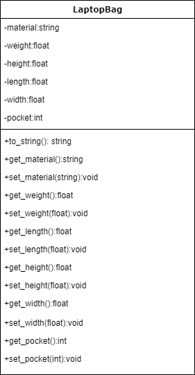

# Класс Сумка для ноутбука

Автор Райков А.М. ИВТ-20

## Поля класса

* материал
* вес
* длина
* высота
* ширина
* колличество карманов

## Методы

* сеттеры, геттеры
* Вывод всей информации в виде строки
* Конструктор по умолчанию
* Конструкторы с параметрами

## Пример использования класса

``` c++
int main()
{
    system("chcp 1251");				// русский язык в консоли
    system("cls");					// очистка консоли

    LaptopBag bag1;					// создание объекта класса
    cout << "Bag1" << endl << bag1.show() << endl;	// вывод

    bag1.set_pocket(5);					// устанавливаем кол-во карманов
    bag1.set_width(53);					// устанавливаем ширину

    cout << "Bag1" << endl << bag1.show();		// вывод изменённого
}
```

## Тесты:
``` c++
#include "pch.h"
#include "../Класс/LaptopBag.h"

TEST(LaptopBag, Height) {
	LaptopBag b;
	b.set_height(200);
	EXPECT_EQ(b.get_height(), 200);
}

TEST(LaptopBag, Material) {
	LaptopBag b;
	b.set_material("мифрил");
	EXPECT_EQ(b.get_material(), "мифрил");
}

TEST(LaptopBag, Length) {
	LaptopBag b;
	b.set_length(123);
	EXPECT_EQ(b.get_length(), 123);
}


TEST(LaptopBag, Pocket) {
	LaptopBag b;
	b.set_pocket(6);
	EXPECT_EQ(b.get_pocket(), 6);
}

TEST(LaptopBag, Weight) {
	LaptopBag b;
	b.set_weight(35);
	EXPECT_EQ(b.get_weight(), 35);
}

TEST(LaptopBag, Width) {
	LaptopBag b;
	b.set_width(40);
	EXPECT_EQ(b.get_width(), 40);
}
```

## UML Diagram

